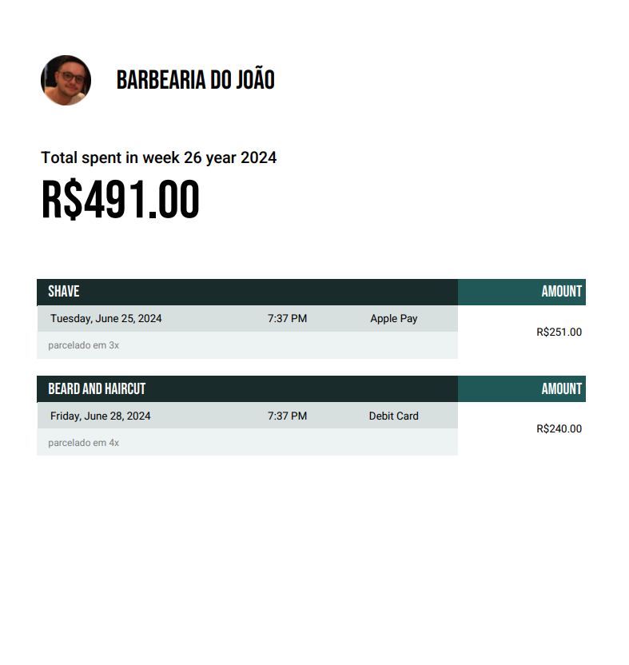

# 💈 BarberShop Manager API – Gerenciador de Barbearia

## 📌 Sobre o Projeto
O **BarberShop Manager API**, desenvolvido em .NET, segue os princípios do Domain-Driven Design (DDD), com foco em organizar e automatizar a geração de relatórios semanais de faturamento da barbearia.

O sistema possibilita registrar serviços realizados, clientes atendidos e formas de pagamento, consolidando os dados em um **relatório PDF semanal** no formato mostrado abaixo:

- Corte de Cabelo.
- Barba.  
- Combo (Corte + Barba).  
- Outras categorias personalizáveis.

📄 Exemplo de relatório:




---

## 🛠 Tecnologias Utilizadas
- .NET 8
- MySQL
- Entity Framework Core
- MigraDoc (para geração de PDF)
- SwaggerUI

---

## 📦 Principais Pacotes NuGet
- **Entity Framework Core** – ORM para mapeamento de objetos e persistência em banco de dados.
- **FluentValidation** – Validação fluida e extensível para requests e entidades do domínio.
- **AutoMapper** – Mapeamento automático entre DTOs e entidades.
- **MigraDoc** – Biblioteca para geração e manipulação de arquivos PDF.
- **Swashbuckle.AspNetCore** – Geração automática de documentação Swagger para a API.

---

## ✨ Features
- **Cadastro de Serviços**: Registre cortes, barbas e outros atendimentos com data, valor e horário.  
- **Relatórios Semanais**: Gere automaticamente relatórios em PDF com o faturamento da semana.  
- **Pagamentos**: Suporte a múltiplas formas de pagamento (cartão, dinheiro, pix, etc).  
- **Histórico**: Consulte o histórico de relatórios gerados e exporte novamente quando necessário.  
- **DDD + Clean Architecture**: Projeto estruturado seguindo boas práticas de organização de código.  

---

## 🚀 Getting Started

### 📋 Requisitos
- Visual Studio 2022+ ou Visual Studio Code  
- Windows 10+  
- Banco de Dados MySQL rodando localmente ou em container Docker  
- **Docker Desktop** (para rodar com Docker)  

---

## 🐳 Rodando com Docker (Recomendado)

> Este repositório já inclui **Dockerfile** e **docker-compose.yml** configurados para subir **API + MySQL**.

### 1) Clonar o repositório
```bash
git clone https://github.com/jpsilvacosta/Gerenciador-de-Barbearia.git
cd Gerenciador-de-Barbearia
```
### 2) Suba os containers com Docker Compose:
```bash
docker-compose up --build
```
> Isto vai subir dois containers:
- "**barberboss-mysql**:banco MySQL"
- "**barberboss-api**:sua API .NET"

### 3) Aguarde até que o Docker finalize o build.
### 4) Acesse a API pelo navegador no endereço:
```bash
http://localhost:5000/swagger
```
> Você verá a documentação interativa da API.

## 🛠️ Comandos úteis
- **Ver logs da API:**
```bash
docker logs barberboss-api
```
- **Parar containers:**
```bash
docker-compose down
```
- **Recriar do zero(caso dê erro):**
```bash
docker-compose down -v
docker-compose up --build
```

Acesse a [documentação oficial do Docker](https://docs.docker.com/) para mais detalhes.

## 🔍 Rodando os Testes

Para executar os testes após clonar o repositório, utilize o comando:

```bash
dotnet test
```

## 🧾 Licença
Projeto educacional para fins de estudo/demonstração.
